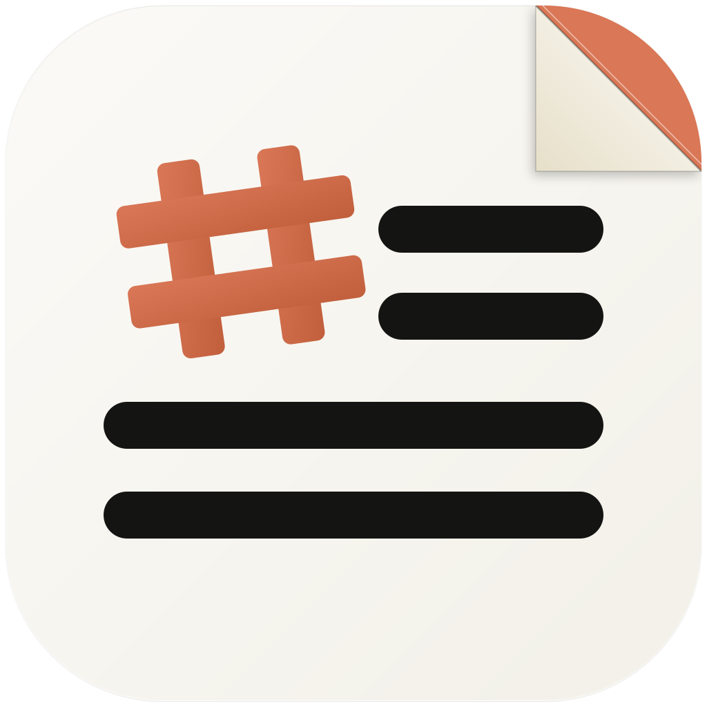

# MDV

<div align="center">

**English** | [한국어](README.ko.md)

  
</div>

MDV is a desktop Markdown editor and viewer for macOS, with a clean,
Claude-inspired writing surface. Open a single file or an entire folder as a
project, edit in source mode or a live split preview, and pick up right where
you left off — open tabs, sidebar state, and theme all restore automatically
on the next launch. Rendering supports GFM tables and task lists,
syntax-highlighted code blocks, Mermaid diagrams, and LaTeX math.

> [!IMPORTANT]
> MDV is distributed as an **unsigned macOS app**. There is no Apple Developer ID signing or notarization for this project.
> The install/update scripts below build or install MDV locally, copy `MDV.app` into `/Applications`, and clear the macOS quarantine attribute with `xattr -dr com.apple.quarantine` to reduce Gatekeeper friction.

## Install / Update

MDV supports three distribution paths: Homebrew, GitHub Release installs, and direct local builds from this repository.

### Install via Homebrew

```bash
brew install --cask oiysful/tap/mdv
```

This uses the [`oiysful/homebrew-tap`](https://github.com/oiysful/homebrew-tap) cask, which tracks the same `MDV-*-arm64-mac.zip` release asset as the `install:release` path below and clears the quarantine attribute automatically after install. Apple Silicon (arm64) only — see [Known Limitations](#known-limitations).

Note: `brew` requires the full `<user>/<repo>/<cask>` form for a one-shot install — `oiysful/tap` alone will not resolve. Once tapped (`brew tap oiysful/tap`), the bare `mdv` name also works, but plain `brew install mdv` (without `--cask`) would instead install an unrelated Homebrew Core formula also named `mdv`, so always keep `--cask` and the full path in scripts/docs.

To update:

```bash
brew upgrade --cask oiysful/tap/mdv
```

### Direct build from source

Use this when you want to clone the repository and build the app yourself.

```bash
git clone https://github.com/oiysful/MDV.git
cd MDV
npm run install:local
```

For later updates from the same clone:

```bash
cd MDV
npm run update:local
```

`update:local` runs `git pull --ff-only origin main`, reinstalls dependencies, rebuilds unsigned, and replaces `/Applications/MDV.app`.

### Install from GitHub Releases

Use this when a release artifact is available and you do not want to build locally.

```bash
npm run install:release
```

For later release-based updates:

```bash
npm run update:release
```

By default, release scripts install the latest GitHub Release. To install a specific tag:

```bash
MDV_RELEASE_TAG=v1.0.0 npm run install:release
```

## Features

**Editing & rendering**
- Markdown preview + source editing modes, with a live split view
- GFM tables, task lists, and syntax-highlighted code blocks
- Mermaid diagrams and LaTeX/math rendering, right inside a code fence
- Auto theme, light theme, dark theme
- Save / Save As / Print / Copy controls

**Navigation & organization**
- Multi-tab workflow with drag reorder
- Directory explorer for `.md` / `.markdown` files
- TOC / explorer sidebar with custom context menus
- Clicking a local file link (relative or absolute) opens it directly — markdown as a new tab, other files via the OS default app
- Finder reveal support from explorer context menus
- Keyboard-accessible tab bar and explorer tree (roving tabindex, arrow-key navigation)

**Workflow & reliability**
- File change watching for opened files
- Session restore: open tabs and the explorer root reopen automatically on next launch; recently opened/saved files appear in the macOS Dock's "최근 항목" menu
- Split view always keeps the sidebar closed while active, restoring it to its prior state on exit
- First-launch empty-state guidance and stronger open-entry onboarding, with an explorer root header for path toggle and close
- Holding ⌘ reveals shortcut badges on buttons that have a real system accelerator

## Built with

MDV runs entirely on your machine: documents are read from and written to disk only, there's no telemetry, and no account or sign-in of any kind.

- Electron
- marked, highlight.js, Mermaid, KaTeX — Markdown/diagram/math rendering, sanitized with DOMPurify before it reaches the screen
- chokidar — file watching

## First Launch UX

- On an empty launch, MDV emphasizes the top-right **열기** entry point.
- The empty state includes direct **파일 열기** / **폴더 열기** actions.
- A first-launch guidance card explains how to:
  - open a single markdown file
  - open a folder into the explorer
  - drag and drop `.md` / `.markdown`
  - set MDV as the default app manually in Finder

The guidance popup is dismissible and remembered locally.

## Development

```bash
git clone https://github.com/oiysful/MDV.git
cd MDV
npm install
npm start
```

Branching, PR, and CI conventions are in [CONTRIBUTING.md](CONTRIBUTING.md); the release process is in [RELEASING.md](RELEASING.md). For the full architecture, module map, and test-tier breakdown, see [AGENTS.md](AGENTS.md).

## Build a distributable app

Create a packaged macOS build:

```bash
npm run build
```

Current build outputs:

- `dist/mac-arm64/MDV.app`
- `dist/MDV-1.3.0-arm64-mac.zip`

## Distribution Notes

- MDV is intentionally distributed without Apple Developer ID signing or notarization.
- Local install/update scripts build with `CSC_IDENTITY_AUTO_DISCOVERY=false` and `--publish=never`.
- All install/update scripts replace `/Applications/MDV.app` and run `xattr -dr com.apple.quarantine` on the installed app bundle.
- If `/Applications` is not writable for your user, rerun the install/update command with appropriate macOS permissions.
- Pushing a `v*` tag builds and publishes releases automatically; see [RELEASING.md](RELEASING.md) for the full pipeline and its required secrets.

## Known Limitations

- Notarization is still pending for friendlier macOS distribution.
- The Homebrew cask and all release builds target Apple Silicon (arm64) only; there is no Intel (x64) build.
- Session restore persists only the last-focused window's state (file paths + active tab index + explorer root); multi-window session merging is out of scope for v1.
